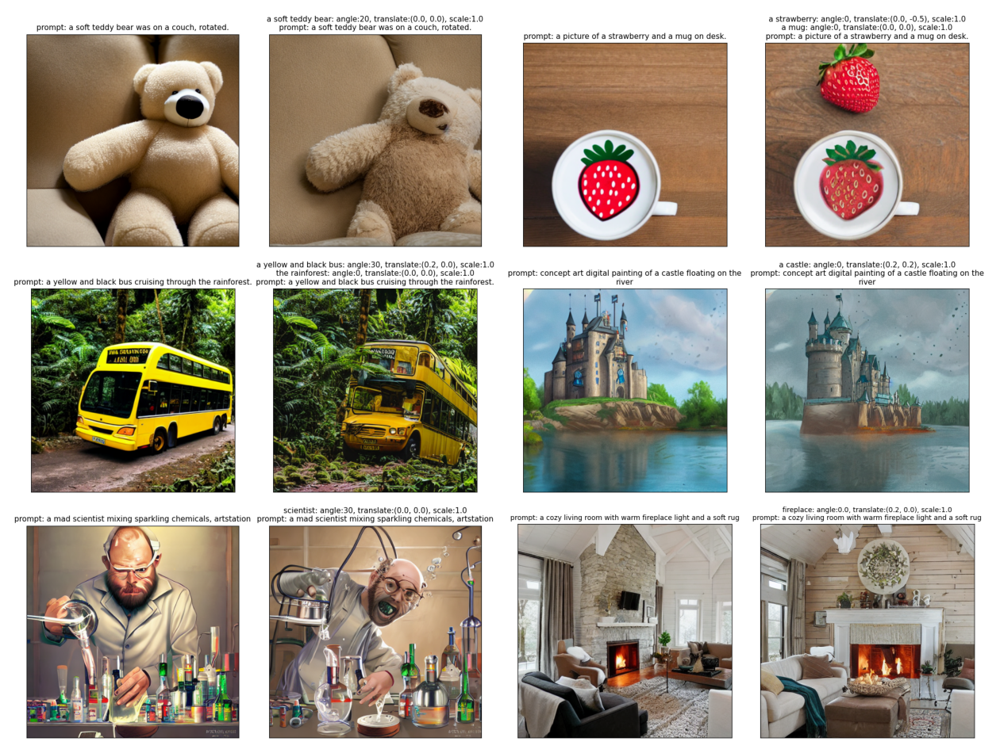
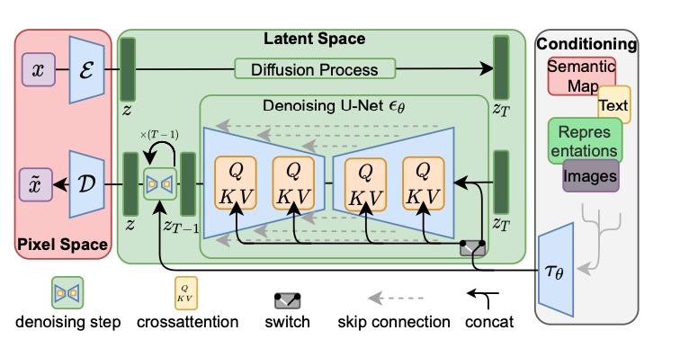
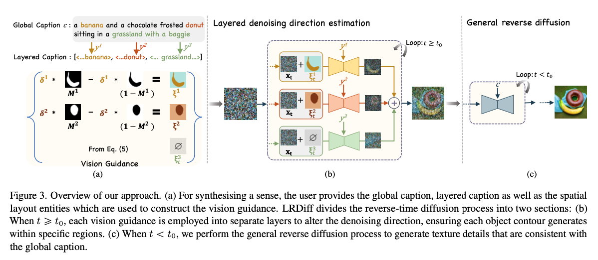
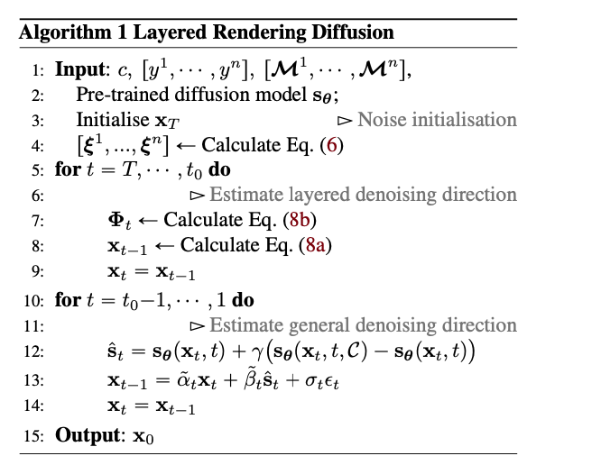
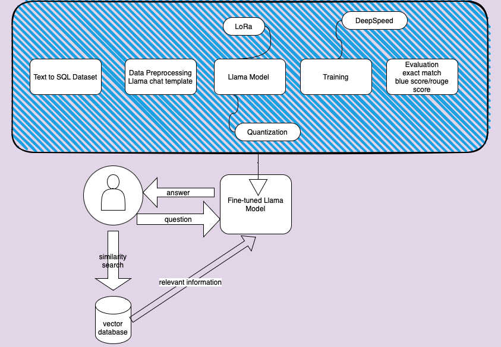

# SHAN YANG homepage


## MFTF: Mask-free Training-free Object Level Layout Control Diffusion Model


**Text-to-image generation models have revolutionized content creation, but diffusion-based vision-language models still face challenges in precisely controlling the shape, appearance, and positional placement of objects in generated images using text guidance alone. Existing global image editing models rely on additional masks or images as guidance to achieve layout control, often requiring retraining of the model. While local object-editing models allow modifications to object shapes, they lack the capability to control object positions. To address these limitations, we propose the Mask-free Training-free Object-Level Layout Control Diffusion Model (MFTF), which provides precise control over object positions without requiring additional masks or images. The MFTF model supports both single-object and multi-object positional adjustments, such as translation and rotation, while enabling simultaneous layout control and object semantic editing. The MFTF model employs a parallel denoising process for both the source and target diffusion models. During this process, attention masks are dynamically generated from the cross-attention layers of the source diffusion model and applied to queries from the self-attention layers to isolate objects. These queries, generated in the source diffusion model, are then adjusted according to the layout control parameters and re-injected into the self-attention layers of the target diffusion model. This approach ensures accurate and precise positional control of objects. [[Paper](https://arxiv.org/abs/2412.01284v2)]**

### Model Architechture


### Model Results


### Citation
```bibtex
@misc{yang2024mftf,
    title={MFTF: Mask-free Training-free Object Level Layout Control Diffusion Model},
    author={Shan Yang},
    year={2024},
    eprint={2412.01284},
    archivePrefix={arXiv},
    primaryClass={cs.CV}
}
```

## Layered Rendering Diffusion Model
### Latent Diffuse Model
The **latent diffusion model** can further reduce the time of the forward and reverse processes by performing the diffusion in the latent space without reducing synthesis quality (Rombach et al., 2022). The architecture of the latent diffusion model is shown in Figure 2. The latent diffusion model includes two stages: 
1. The first stage contains a **VAE** (Razavi et al., 2019) or **VQGAN** (Esser et al., 2021) model. The encoder $`\varepsilon`$ encodes $`x`$ into the latent space $`z`$, and the decoder $`D`$ decodes $`z`$ into the image space.
2. In the second stage, forward and reverse diffusion happens in the latent space $`z`$, thus reducing the training and inference time.
The conditions are added to the diffusion model after being embedded using the encoder $`\tau_{\theta}`$. The encoded conditions are queried in the cross-attention layers of the modified U-Net $`\epsilon_{\theta}`$ model.

<figure>
  
  <figcaption>Figure 2. The architecture of latent diffuse model (Rombach et al.,2022) </figcaption>
</figure>

### Layered Rendering Diffusion Model
Control the layout of the images generated from the diffusion model, **_without retraining or fine-tuning_**, and achieve better semantic alignment.
<figure>
  
</figure>
The algorithm of layer rendering model is shown below:
<figure>
  
</figure>


### Unoffical Implementation
Since the paper did not publish the implementation, I have implemented the approach described in the paper without strictly following the algorithm due to some confusion in the model description. Therefore, this implementation takes the essence of the algorithm, which adds vision guidance to the noise image in the latent space. The current implementation follows the steps below:

1. Modify only the "up_attention" module in the U-Net, selecting the attention map with the top-k intensities. Then, go through a single sampling step and generate the vision guidance by weighting the layout with the attention map.
2. The weighted mask is then added to the random noise for image generation.
3. The following algorithm exactly follows the algorithm shown above.

### Result of this Implementation
This is the image generated in the <a href="https://drive.google.com/file/d/1KcNvrjh7k5G4FFbzeMfdGruA-o0Y4XZB/view?usp=share_link">layer rendering diffusion model colab </a>
<figure>
  
</figure>


## Text-to-SQL RAG Chatbot based on Instruction Fine-tuned Llama (7B) Model
This project contains two parts: 
1. Instruction fine-tuning Llama model on Text-to-SQL dataset.
2. Constructed a vector database to enhance Llama’s performance utilizing the Retrieval-Augmented Generation (RAG) technique and the Langchain framework. And developed a Gradio chat web demo.

3. Best model pushed to huggingface: https://huggingface.co/SHSH0819/Text2SQL-llama2/tree/main


